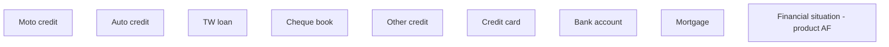

# Financial situation - product AF

```mermaid
graph TD
    Moto_credit["Moto credit"]
    Auto_credit["Auto credit"]
    TW_loan["TW loan"]
    Cheque_book["Cheque book"]
    Other_credit["Other credit"]
    Credit_card["Credit card"]
    Bank_account["Bank account"]
    Mortgage["Mortgage"]
    Financial_situation_product_AF["Financial situation - product AF"]
```
