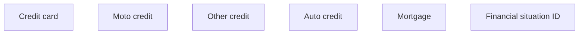

# Financial situation ID

- **Diagram Type**: Custom
- **Package**: HomerSelect/BSL/Analysis Model/Contract Origination/Fill in application/COMMON for Fill in application/User Interface Model/ID/Employment information ID/Financial situation ID
- **Diagram ID**: 79050
- **Elements**: 6
- **Connectors**: 0

