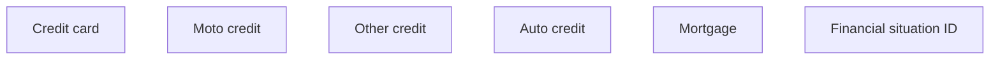

# Financial situation ID

```mermaid
graph TD
    Credit_card["Credit card"]
    Moto_credit["Moto credit"]
    Other_credit["Other credit"]
    Auto_credit["Auto credit"]
    Mortgage["Mortgage"]
    Financial_situation_ID["Financial situation ID"]
```
