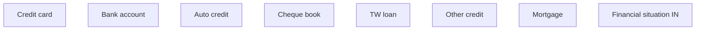

# Financial situation IN

```mermaid
graph TD
    Credit_card["Credit card"]
    Bank_account["Bank account"]
    Auto_credit["Auto credit"]
    Cheque_book["Cheque book"]
    TW_loan["TW loan"]
    Other_credit["Other credit"]
    Mortgage["Mortgage"]
    Financial_situation_IN["Financial situation IN"]
```
