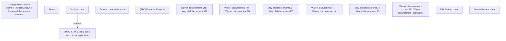

# General bank account

```mermaid
graph TD
    Change_disbursement_channel_modal_window_Change_disbursement["Change disbursement channel (modal window) : Change disbursement channel"]
    Result["Result"]
    Verify_account["Verify account"]
    Bank_account_verification["Bank account verification"]
    ADD_Rewards_Rewards["{ADD}Rewards :Rewards"]
    Way_of_disbursement_VN_Way_of_disbursement_VN["Way of disbursement VN : Way of disbursement VN"]
    Way_of_disbursement_PH_Way_of_disbursement_PH["Way of disbursement PH : Way of disbursement PH"]
    Way_of_disbursement_KZ_Way_of_disbursement_KZ["Way of disbursement KZ : Way of disbursement KZ"]
    Way_of_disbursement_IN_Way_of_disbursement_IN["Way of disbursement IN : Way of disbursement IN"]
    Way_of_disbursement_ID_Way_of_disbursement_ID["Way of disbursement ID : Way of disbursement ID"]
    Way_of_disbursement_product_AF_Way_of_disbursement_product_A["Way of disbursement - product AF : Way of disbursement - product AF"]
    MOD_01_065_Verify_bank_account_for_application["{MOD}01.065 Verify bank account for application"]
    Edit_Bank_Account["Edit Bank Account"]
    General_bank_account["General bank account"]
    Verify_account -->|unnamed| MOD_01_065_Verify_bank_account_for_application
```
