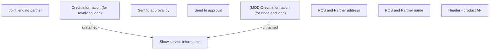

# Header - product AF

- **Diagram Type**: Custom
- **Package**: HomerSelect/BSL/Analysis Model/Contract Origination/Fill in application/COMMON for Fill in application/User Interface Model/Product/Header - product AF
- **Diagram ID**: 148135
- **Elements**: 9
- **Connectors**: 2

