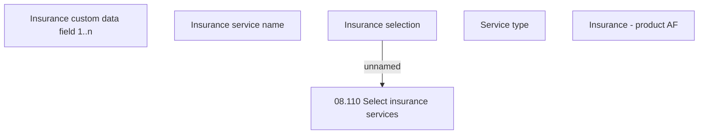

# Insurance - product AF

```mermaid
graph TD
    Insurance_custom_data_field_1_n["Insurance custom data field 1..n"]
    Insurance_service_name["Insurance service name"]
    n_08_110_Select_insurance_services["08.110 Select insurance services"]
    Insurance_selection["Insurance selection"]
    Service_type["Service type"]
    Insurance_product_AF["Insurance - product AF"]
    Insurance_selection -->|unnamed| n_08_110_Select_insurance_services
```
