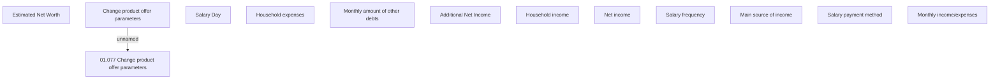

# Monthly income/expenses - product AF

```mermaid
graph TD
    Estimated_Net_Worth["Estimated Net Worth"]
    n_01_077_Change_product_offer_parameters["01.077 Change product offer parameters"]
    Change_product_offer_parameters["Change product offer parameters"]
    Salary_Day["Salary Day"]
    Household_expenses["Household expenses"]
    Monthly_amount_of_other_debts["Monthly amount of other debts"]
    Additional_Net_Income["Additional Net Income"]
    Household_income["Household income"]
    Net_income["Net income"]
    Salary_frequency["Salary frequency"]
    Main_source_of_income["Main source of income"]
    Salary_payment_method["Salary payment method"]
    Monthly_income_expenses["Monthly income/expenses"]
    Change_product_offer_parameters -->|unnamed| n_01_077_Change_product_offer_parameters
```
