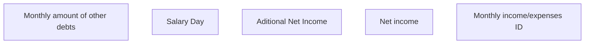

# Monthly income/expenses ID

```mermaid
graph TD
    Monthly_amount_of_other_debts["Monthly amount of other debts"]
    Salary_Day["Salary Day"]
    Aditional_Net_Income["Aditional Net Income"]
    Net_income["Net income"]
    Monthly_income_expenses_ID["Monthly income/expenses ID"]
```
