# Monthly income/expenses IN

- **Diagram Type**: Custom
- **Package**: HomerSelect/BSL/Analysis Model/Contract Origination/Fill in application/COMMON for Fill in application/User Interface Model/IN/Employment information IN/Monthly income/expenses IN
- **Diagram ID**: 153781
- **Elements**: 10
- **Connectors**: 0

```mermaid
graph TD
    Estimated_Net_Worth["Estimated Net Worth"]
    Monthly_family_expenses["Monthly family expenses"]
    Monthly_amount_of_other_debts["Monthly amount of other debts"]
    Household_income["Household income"]
    Salary_day_DD["Salary day (DD)"]
    Additional_net_income["Additional net income"]
    Net_income["Net income"]
    Main_source_of_income["Main source of income"]
    Salary_payment_method["Salary payment method"]
    Monthly_income_expenses_IN["Monthly income/expenses IN"]
```

