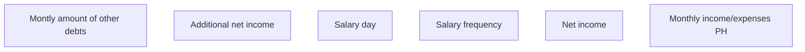

# Monthly income/expenses PH

- **Diagram Type**: Custom
- **Package**: HomerSelect/BSL/Analysis Model/Contract Origination/Fill in application/COMMON for Fill in application/User Interface Model/PH/Employment information PH/Monthly income/expenses PH
- **Diagram ID**: 77826
- **Elements**: 6
- **Connectors**: 0

