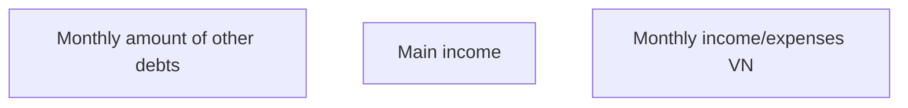

# Monthly income/expenses VN

- **Diagram Type**: Custom
- **Package**: HomerSelect/BSL/Analysis Model/Contract Origination/Fill in application/COMMON for Fill in application/User Interface Model/VN/Employment information VN/Monthly income/expenses VN
- **Diagram ID**: 83051
- **Elements**: 3
- **Connectors**: 0

