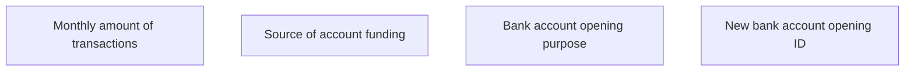

# New bank account opening ID

- **Diagram Type**: Custom
- **Package**: HomerSelect/BSL/Analysis Model/Contract Origination/Fill in application/COMMON for Fill in application/User Interface Model/ID/Employment information ID/New bank account opening ID
- **Diagram ID**: 107631
- **Elements**: 4
- **Connectors**: 0

