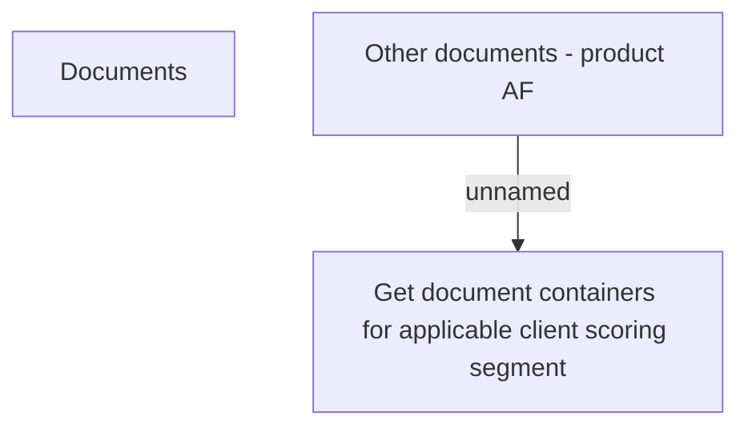

# Other documents - product AF

```mermaid
graph TD
    Get_document_containers_for_applicable_client_scoring_segmen["Get document containers for applicable client scoring segment"]
    Documents["Documents"]
    Other_documents_product_AF["Other documents - product AF"]
    Other_documents_product_AF -->|unnamed| Get_document_containers_for_applicable_client_scoring_segmen
```
