# Other information - product AF

- **Diagram Type**: Custom
- **Package**: HomerSelect/BSL/Analysis Model/Contract Origination/Fill in application/COMMON for Fill in application/User Interface Model/Product/Other information - product AF/Other information - product AF
- **Diagram ID**: 158508
- **Elements**: 11
- **Connectors**: 0

```mermaid
graph TD
    Reason_for_using_HoSel_description["Reason for using HoSel description"]
    Reason_for_using_HoSel_code["Reason for using HoSel code"]
    Lead_ID["Lead ID"]
    X_sell_offer_code["X-sell offer code"]
    X_sell_offer_requested["X-sell offer requested"]
    Internal_code2["Internal code2"]
    Comments["Comments"]
    Salesman["Salesman"]
    Additional_information["Additional information"]
    Internal_code["Internal code"]
    Other_information_product_AF["Other information - product AF"]
```

