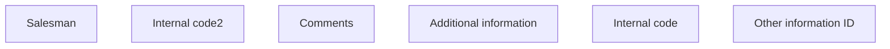

# Other information ID

```mermaid
graph TD
    Salesman["Salesman"]
    Internal_code2["Internal code2"]
    Comments["Comments"]
    Additional_information["Additional information"]
    Internal_code["Internal code"]
    Other_information_ID["Other information ID"]
```
