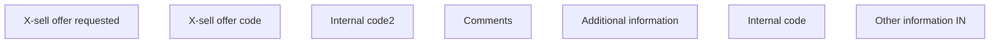

# Other information IN

```mermaid
graph TD
    X_sell_offer_requested["X-sell offer requested"]
    X_sell_offer_code["X-sell offer code"]
    Internal_code2["Internal code2"]
    Comments["Comments"]
    Additional_information["Additional information"]
    Internal_code["Internal code"]
    Other_information_IN["Other information IN"]
```
