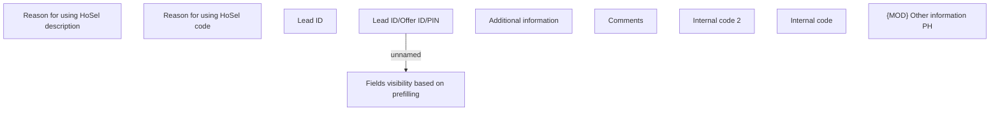

# Other information PH

- **Diagram Type**: Custom
- **Package**: HomerSelect/BSL/Analysis Model/Contract Origination/Fill in application/COMMON for Fill in application/User Interface Model/PH/Other information PH/Other information PH
- **Diagram ID**: 158507
- **Elements**: 10
- **Connectors**: 1

