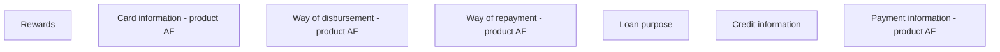

# Payment information - product AF

```mermaid
graph TD
    Rewards["Rewards"]
    Card_information_product_AF["Card information - product AF"]
    Way_of_disbursement_product_AF["Way of disbursement - product AF"]
    Way_of_repayment_product_AF["Way of repayment - product AF"]
    Loan_purpose["Loan purpose"]
    Credit_information["Credit information"]
    Payment_information_product_AF["Payment information - product AF"]
```
