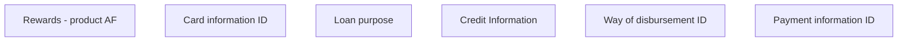

# Payment information ID

```mermaid
graph TD
    Rewards_product_AF["Rewards - product AF"]
    Card_information_ID["Card information ID"]
    Loan_purpose["Loan purpose"]
    Credit_Information["Credit Information"]
    Way_of_disbursement_ID["Way of disbursement ID"]
    Payment_information_ID["Payment information ID"]
```
