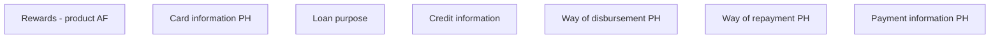

# Payment information PH

- **Diagram Type**: Custom
- **Package**: HomerSelect/BSL/Analysis Model/Contract Origination/Fill in application/COMMON for Fill in application/User Interface Model/PH/Payment information PH
- **Diagram ID**: 158497
- **Elements**: 7
- **Connectors**: 0

