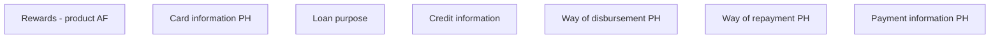

# Payment information PH

```mermaid
graph TD
    Rewards_product_AF["Rewards - product AF"]
    Card_information_PH["Card information PH"]
    Loan_purpose["Loan purpose"]
    Credit_information["Credit information"]
    Way_of_disbursement_PH["Way of disbursement PH"]
    Way_of_repayment_PH["Way of  repayment PH"]
    Payment_information_PH["Payment information PH"]
```
