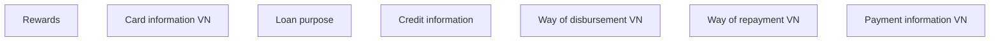

# Payment information VN

```mermaid
graph TD
    Rewards["Rewards"]
    Card_information_VN["Card information VN"]
    Loan_purpose["Loan purpose"]
    Credit_information["Credit information"]
    Way_of_disbursement_VN["Way of disbursement VN"]
    Way_of_repayment_VN["Way of repayment VN"]
    Payment_information_VN["Payment information VN"]
```
