# Personal data - product AF

- **Diagram Type**: Custom
- **Package**: HomerSelect/BSL/Analysis Model/Contract Origination/Fill in application/COMMON for Fill in application/User Interface Model/Product/Personal information - product AF/Personal data - product AF
- **Diagram ID**: 150066
- **Elements**: 16
- **Connectors**: 0

```mermaid
graph TD
    Mother_s_name["Mother's name"]
    Honor_after["Honor after"]
    el_1738786["Boundary"]
    Second_preferred_language["Second preferred language"]
    Preferred_Language["Preferred Language"]
    Gender["Gender"]
    Place_of_birth["Place of birth"]
    Date_of_birth["Date of birth"]
    Nickname["Nickname"]
    Name6["Name6"]
    Name3["Name3"]
    Name2["Name2"]
    Name5["Name5"]
    Name4["Name4"]
    Name1["Name1"]
    Personal_data_product_AF["Personal data - product AF"]
```

