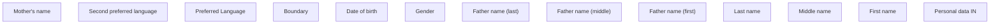

# Personal data IN

```mermaid
graph TD
    Mother_s_name["Mother's name"]
    Second_preferred_language["Second preferred language"]
    Preferred_Language["Preferred Language"]
    el_1295804["Boundary"]
    Date_of_birth["Date of birth"]
    Gender["Gender"]
    Father_name_last["Father name (last)"]
    Father_name_middle["Father name (middle)"]
    Father_name_first["Father name  (first)"]
    Last_name["Last name"]
    Middle_name["Middle name"]
    First_name["First name"]
    Personal_data_IN["Personal data IN"]
```
