# Personal data PH

- **Diagram Type**: Custom
- **Package**: HomerSelect/BSL/Analysis Model/Contract Origination/Fill in application/COMMON for Fill in application/User Interface Model/PH/Personal information PH/Personal data PH
- **Diagram ID**: 139660
- **Elements**: 12
- **Connectors**: 0

```mermaid
graph TD
    Place_of_birth["Place of birth"]
    el_1640029["Boundary"]
    Gender["Gender"]
    Preferred_language["Preferred language"]
    Date_of_birth["Date of birth"]
    Mother_maiden_name["Mother maiden name"]
    Nickname["Nickname"]
    Suffix["Suffix"]
    Last_name["Last name"]
    Middle_name["Middle name"]
    First_name["First name"]
    Pesronal_data_PH["Pesronal data PH"]
```

