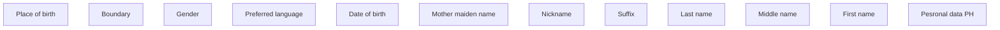

# Personal data PH

```mermaid
graph TD
    Place_of_birth["Place of birth"]
    el_1640029["Boundary"]
    Gender["Gender"]
    Preferred_language["Preferred language"]
    Date_of_birth["Date of birth"]
    Mother_maiden_name["Mother maiden name"]
    Nickname["Nickname"]
    Suffix["Suffix"]
    Last_name["Last name"]
    Middle_name["Middle name"]
    First_name["First name"]
    Pesronal_data_PH["Pesronal data PH"]
```
