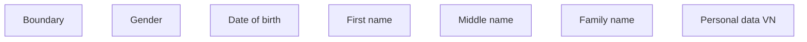

# Personal data VN

- **Diagram Type**: Custom
- **Package**: HomerSelect/BSL/Analysis Model/Contract Origination/Fill in application/COMMON for Fill in application/User Interface Model/VN/Personal information VN/Personal data VN
- **Diagram ID**: 77438
- **Elements**: 7
- **Connectors**: 0

