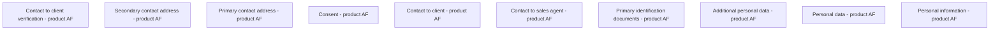

# Personal information - product AF

```mermaid
graph TD
    Contact_to_client_verification_product_AF["Contact to client verification - product AF"]
    Secondary_contact_address_product_AF["Secondary contact address - product AF"]
    Primary_contact_address_product_AF["Primary contact address - product AF"]
    Consent_product_AF["Consent - product AF"]
    Contact_to_client_product_AF["Contact to client - product AF"]
    Contact_to_sales_agent_product_AF["Contact to sales agent - product AF"]
    Primary_identification_documents_product_AF["Primary identification documents - product AF"]
    Additional_personal_data_product_AF["Additional personal data - product AF"]
    Personal_data_product_AF["Personal data - product AF"]
    Personal_information_product_AF["Personal information - product AF"]
```
