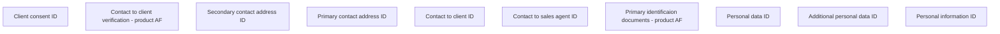

# Personal information ID

```mermaid
graph TD
    Client_consent_ID["Client consent ID"]
    Contact_to_client_verification_product_AF["Contact to client verification - product AF"]
    Secondary_contact_address_ID["Secondary contact address ID"]
    Primary_contact_address_ID["Primary contact address ID"]
    Contact_to_client_ID["Contact to client ID"]
    Contact_to_sales_agent_ID["Contact to sales agent ID"]
    Primary_identificaion_documents_product_AF["Primary identificaion documents - product AF"]
    Personal_data_ID["Personal data ID"]
    Additional_personal_data_ID["Additional personal data ID"]
    Personal_information_ID["Personal information ID"]
```
