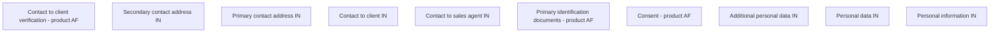

# Personal information IN

```mermaid
graph TD
    Contact_to_client_verification_product_AF["Contact to client verification - product AF"]
    Secondary_contact_address_IN["Secondary contact address IN"]
    Primary_contact_address_IN["Primary contact address IN"]
    Contact_to_client_IN["Contact to client IN"]
    Contact_to_sales_agent_IN["Contact to sales agent IN"]
    Primary_identification_documents_product_AF["Primary identification documents - product AF"]
    Consent_product_AF["Consent - product AF"]
    Additional_personal_data_IN["Additional personal data IN"]
    Personal_data_IN["Personal data IN"]
    Personal_information_IN["Personal information IN"]
```
