# Personal information PH

- **Diagram Type**: Custom
- **Package**: HomerSelect/BSL/Analysis Model/Contract Origination/Fill in application/COMMON for Fill in application/User Interface Model/PH/Personal information PH
- **Diagram ID**: 94842
- **Elements**: 9
- **Connectors**: 0

```mermaid
graph TD
    Client_consent_product_AF["Client consent - product AF"]
    Additional_personal_data_PH["Additional personal data PH"]
    Secondary_contact_address_PH["Secondary contact address PH"]
    Primary_contact_address_PH["Primary contact address PH"]
    Contact_to_client_verification_product_AF["Contact to client verification - product AF"]
    Contact_to_client_PH["Contact to client PH"]
    Primary_identification_documents_product_AF["Primary identification documents - product AF"]
    Personal_data_PH["Personal data PH"]
    Personal_information_PH["Personal information PH"]
```

