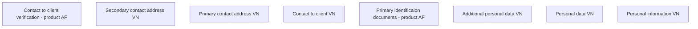

# Personal information VN

```mermaid
graph TD
    Contact_to_client_verification_product_AF["Contact to client verification - product AF"]
    Secondary_contact_address_VN["Secondary contact address VN"]
    Primary_contact_address_VN["Primary contact address VN"]
    Contact_to_client_VN["Contact to client VN"]
    Primary_identificaion_documents_product_AF["Primary identificaion documents - product AF"]
    Additional_personal_data_VN["Additional personal data VN"]
    Personal_data_VN["Personal data VN"]
    Personal_information_VN["Personal information VN"]
```
