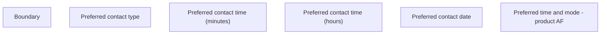

# Preferred time and mode - product AF

```mermaid
graph TD
    el_1422881["Boundary"]
    Preferred_contact_type["Preferred contact type"]
    Preferred_contact_time_minutes["Preferred contact time (minutes)"]
    Preferred_contact_time_hours["Preferred contact time (hours)"]
    Preferred_contact_date["Preferred contact date"]
    Preferred_time_and_mode_product_AF["Preferred time and mode - product AF"]
```
