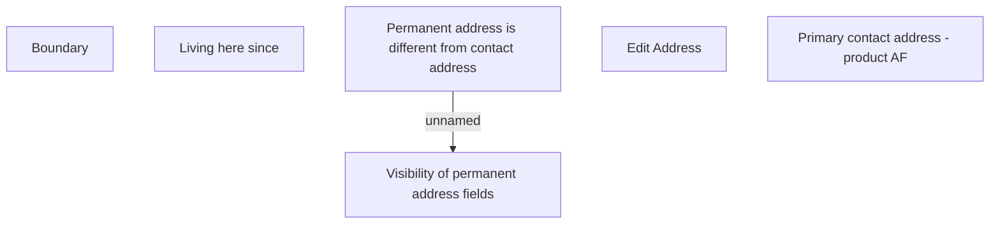

# Primary contact address - product AF

```mermaid
graph TD
    Visibility_of_permanent_address_fields["Visibility of permanent address fields"]
    el_1203842["Boundary"]
    Living_here_since["Living here since"]
    Permanent_address_is_different_from_contact_address["Permanent address is different from contact address"]
    Edit_Address["Edit Address"]
    Primary_contact_address_product_AF["Primary contact address - product AF"]
    Permanent_address_is_different_from_contact_address -->|unnamed| Visibility_of_permanent_address_fields
```
