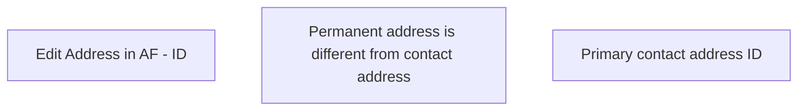

# Primary contact address ID

```mermaid
graph TD
    Edit_Address_in_AF_ID["Edit Address in AF - ID"]
    Permanent_address_is_different_from_contact_address["Permanent address is different from contact address"]
    Primary_contact_address_ID["Primary contact address ID"]
```
