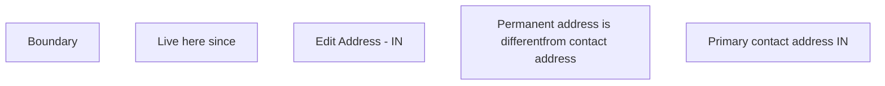

# Primary contact address IN

- **Diagram Type**: Custom
- **Package**: HomerSelect/BSL/Analysis Model/Contract Origination/Fill in application/COMMON for Fill in application/User Interface Model/IN/Personal information IN/Primary contact address IN
- **Diagram ID**: 88574
- **Elements**: 5
- **Connectors**: 0

