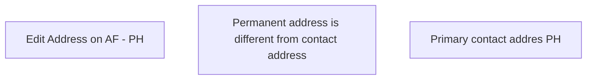

# Primary contact address PH

```mermaid
graph TD
    Edit_Address_on_AF_PH["Edit Address on AF - PH"]
    Permanent_address_is_different_from_contact_address["Permanent address is different from contact address"]
    Primary_contact_addres_PH["Primary contact addres PH"]
```
