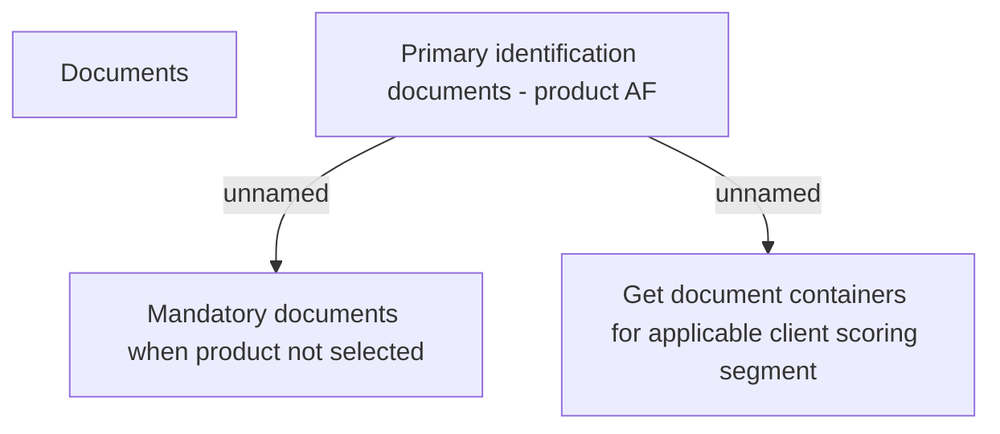

# Primary identification documents - product AF

```mermaid
graph TD
    Get_document_containers_for_applicable_client_scoring_segmen["Get document containers for applicable client scoring segment"]
    Documents["Documents"]
    Mandatory_documents_when_product_not_selected["Mandatory documents when product not selected"]
    Primary_identification_documents_product_AF["Primary identification documents - product AF"]
    Primary_identification_documents_product_AF -->|unnamed| Mandatory_documents_when_product_not_selected
    Primary_identification_documents_product_AF -->|unnamed| Get_document_containers_for_applicable_client_scoring_segmen
```
