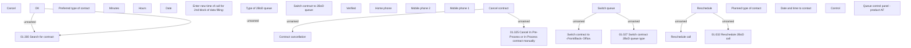

# Queue control panel - product AF

```mermaid
graph TD
    n_01_300_Search_for_contract["01.300 Search for contract"]
    n_01_325_Cancel_In_Pre_Process_or_In_Process_contract_manual["01.325 Cancel In Pre-Process or In Process contract manually"]
    n_01_027_Switch_contract_2BoD_queue_type["01.027 Switch contract 2BoD queue type"]
    n_01_032_Reschedule_2BoD_call["01.032 Reschedule 2BoD call"]
    Contract_cancellation["Contract cancellation"]
    Cancel["Cancel"]
    OK["OK"]
    Preferred_type_of_contact["Preferred type of contact"]
    Minutes["Minutes"]
    Hours["Hours"]
    Date["Date"]
    Enter_new_time_of_call_for_2nd_block_of_data_filling["Enter new time of call for 2nd block of data filling:"]
    Reschedule_call["Reschedule call"]
    Cancel["Cancel"]
    OK["OK"]
    Type_of_2BoD_queue["Type of 2BoD queue"]
    Switch_contract_to_2BoD_queue["Switch contract to 2BoD queue:"]
    Switch_contract_to_Front_Back_Office["Switch contract to ‹Front/Back› Office."]
    Verified["Verified"]
    Verified["Verified"]
    Home_phone["Home phone"]
    Mobile_phone_2["Mobile phone 2"]
    Verified["Verified"]
    Mobile_phone_1["Mobile phone 1"]
    Cancel_contract["Cancel contract"]
    Switch_queue["Switch queue"]
    Reschedule["Reschedule"]
    Planned_type_of_contact["Planned type of contact"]
    Date_and_time_to_contact["Date and time to contact"]
    Control["Control"]
    Queue_control_panel_product_AF["Queue control panel - product AF"]
    Switch_queue -->|unnamed| Switch_contract_to_Front_Back_Office
    Reschedule -->|unnamed| Reschedule_call
    Cancel_contract -->|unnamed| Contract_cancellation
    Reschedule -->|unnamed| n_01_032_Reschedule_2BoD_call
    Switch_queue -->|unnamed| n_01_027_Switch_contract_2BoD_queue_type
    Cancel_contract -->|unnamed| n_01_325_Cancel_In_Pre_Process_or_In_Process_contract_manual
    OK -->|unnamed| n_01_300_Search_for_contract
    OK -->|unnamed| n_01_300_Search_for_contract
```
