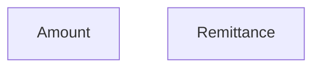

# Remittance - product AF

- **Diagram Type**: Custom
- **Package**: HomerSelect/BSL/Analysis Model/Contract Origination/Fill in application/COMMON for Fill in application/User Interface Model/Product/Contact information - product AF/Remittance - product AF
- **Diagram ID**: 139560
- **Elements**: 2
- **Connectors**: 0

