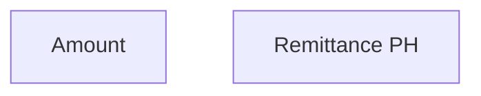

# Remittance PH

- **Diagram Type**: Custom
- **Package**: HomerSelect/BSL/Analysis Model/Contract Origination/Fill in application/COMMON for Fill in application/User Interface Model/PH/Contact information PH/Remittance PH
- **Diagram ID**: 139559
- **Elements**: 2
- **Connectors**: 0

