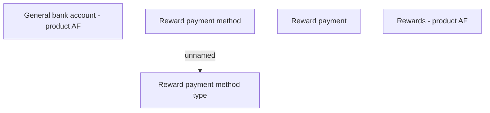

# Rewards - product AF

```mermaid
graph TD
    General_bank_account_product_AF["General bank account - product AF"]
    Reward_payment_method_type["Reward payment method type"]
    Reward_payment_method["Reward payment method"]
    Reward_payment["Reward payment"]
    Rewards_product_AF["Rewards - product AF"]
    Reward_payment_method -->|unnamed| Reward_payment_method_type
```
