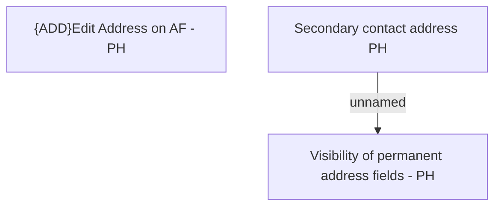

# Secondary contact address PH

- **Diagram Type**: Custom
- **Package**: HomerSelect/BSL/Analysis Model/Contract Origination/Fill in application/COMMON for Fill in application/User Interface Model/PH/Personal information PH/Secondary contact address PH
- **Diagram ID**: 111748
- **Elements**: 3
- **Connectors**: 1

