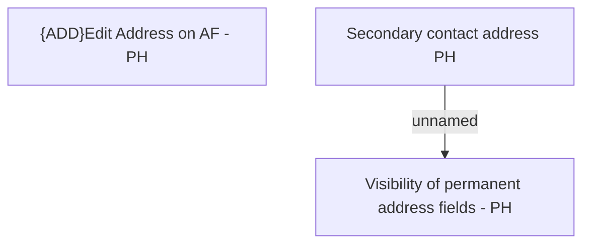

# Secondary contact address PH

```mermaid
graph TD
    Visibility_of_permanent_address_fields_PH["Visibility of permanent address fields - PH"]
    ADD_Edit_Address_on_AF_PH["{ADD}Edit Address on AF - PH"]
    Secondary_contact_address_PH["Secondary contact address PH"]
    Secondary_contact_address_PH -->|unnamed| Visibility_of_permanent_address_fields_PH
```
