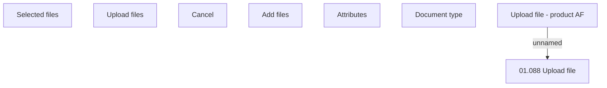

# Upload files

- **Diagram Type**: Custom
- **Package**: HomerSelect/BSL/Analysis Model/Contract Origination/Fill in application/COMMON for Fill in application/User Interface Model/COMMON for User Interface/Document panel/Upload files
- **Diagram ID**: 120315
- **Elements**: 8
- **Connectors**: 1

