# Way of  repayment PH

- **Diagram Type**: Custom
- **Package**: HomerSelect/BSL/Analysis Model/Contract Origination/Fill in application/COMMON for Fill in application/User Interface Model/PH/Payment information PH/Way of  repayment PH
- **Diagram ID**: 158356
- **Elements**: 13
- **Connectors**: 0

```mermaid
graph TD
    ADD_Existing_DDM["{ADD}Existing DDM"]
    DDM_type["DDM type"]
    Source["Source"]
    Frequency["Frequency"]
    Regular_payment_amount["Regular payment amount"]
    Regular_payment["Regular payment"]
    Use_DDM_account_for_credit_disbursement["Use DDM account for credit disbursement"]
    Create_Update_bank_acount_PH["Create/Update bank acount - PH"]
    Limit["Limit"]
    Direct_debit_mandate["Direct debit mandate"]
    Repayment_method["Repayment method"]
    Payment_method["Payment method"]
    Way_of_repayment_PH["Way of repayment PH"]
```

