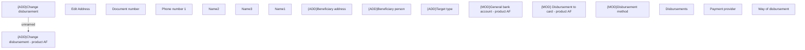

# Way of disbursement - product AF

```mermaid
graph TD
    ADD_Change_disbursement_product_AF["{ADD}Change disbursement - product AF"]
    ADD_Change_disbursement["{ADD}Change disbursement"]
    Edit_Address["Edit Address"]
    Document_number["Document number"]
    Phone_number_1["Phone number 1"]
    Name2["Name2"]
    Name3["Name3"]
    Name1["Name1"]
    ADD_Beneficiary_address["{ADD}Beneficiary address"]
    ADD_Beneficiary_person["{ADD}Beneficiary person"]
    ADD_Target_type["{ADD}Target type"]
    MOD_General_bank_account_product_AF["{MOD}General bank account - product AF"]
    MOD_Disbursement_to_card_product_AF["{MOD} Disbursement to card - product AF"]
    MOD_Disbursement_method["{MOD}Disbursement method"]
    Disbursements["Disbursements"]
    Payment_provider["Payment provider"]
    Way_of_disbursement["Way of disbursement"]
    ADD_Change_disbursement -->|unnamed| ADD_Change_disbursement_product_AF
```
