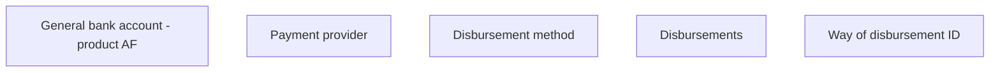

# Way of disbursement ID

```mermaid
graph TD
    General_bank_account_product_AF["General bank account - product AF"]
    Payment_provider["Payment provider"]
    Disbursement_method["Disbursement method"]
    Disbursements["Disbursements"]
    Way_of_disbursement_ID["Way of disbursement ID"]
```
