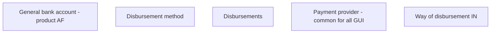

# Way of disbursement IN

- **Diagram Type**: Custom
- **Package**: HomerSelect/BSL/Analysis Model/Contract Origination/Fill in application/COMMON for Fill in application/User Interface Model/IN/Payment information IN/Way of disbursement IN
- **Diagram ID**: 107735
- **Elements**: 5
- **Connectors**: 0

